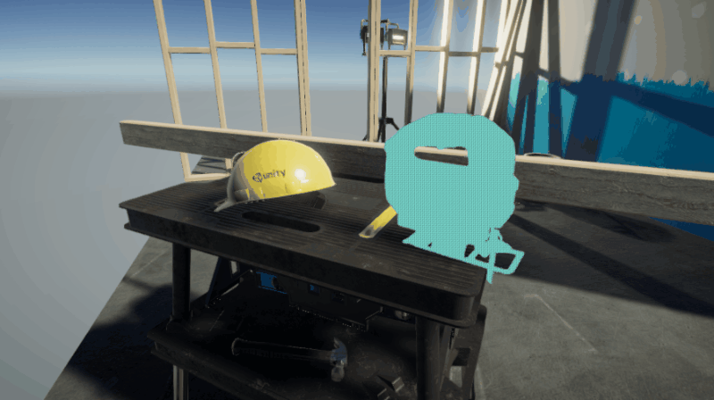
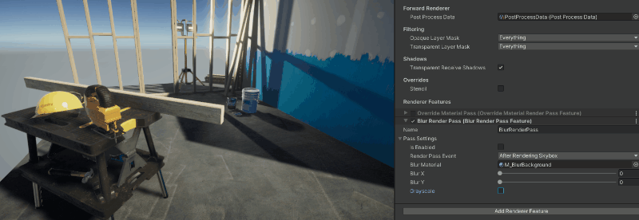
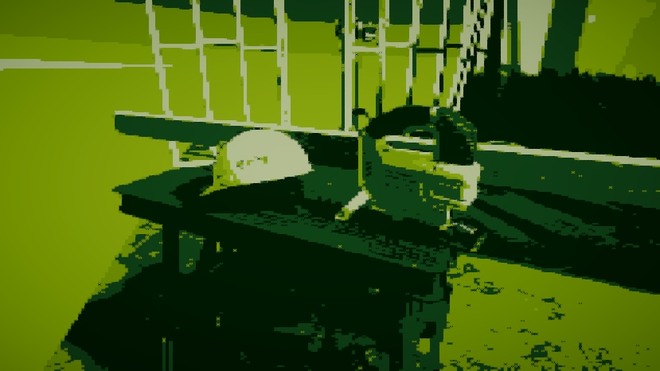
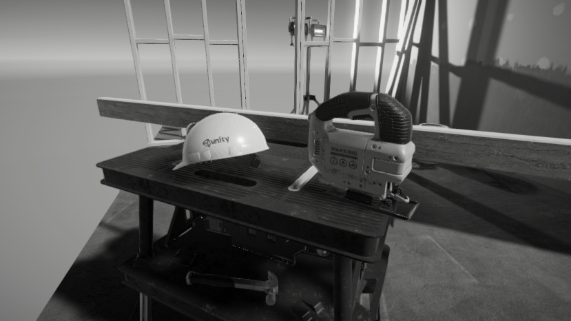
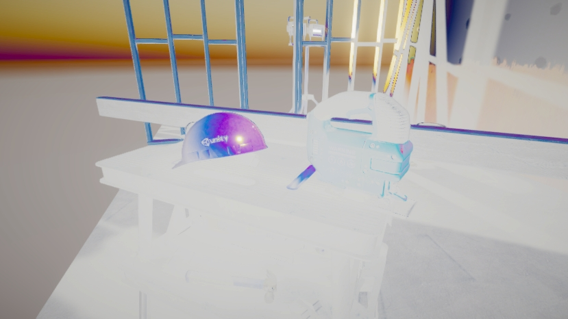
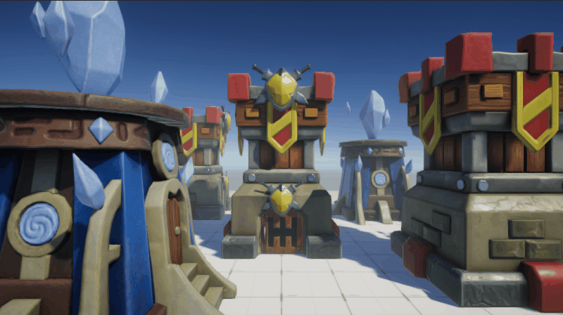

# UniversalRP - Custom Render Passes
This repository contains a collection of Custom Renderer Features examples.

###### Current support: Unity 2020.3.21f1 with UniversalRP 10.6.0

**Usage of the project**
* Clone the repository or download the zip to use this project locally.
* Load the project using Unity 2020.3.21f1 or later
* Each scene (located at Scenes folder) contains a different Scriptable Render Pass example

**Project layout**
* `Scripts/Graphics/RendererFeatures`: This folder constains the Scriptable Render Features. Each Scriptable Render Feature is developed using two scripts, one concerning to the [ScriptableRendererFeature](https://docs.unity3d.com/Packages/com.unity.render-pipelines.universal@10.6/api/UnityEngine.Rendering.Universal.ScriptableRendererFeature.html?q=ScriptableRendererFeature), and the other one, that has the [ScriptableRenderPass](https://docs.unity3d.com/Packages/com.unity.render-pipelines.universal@10.6/api/UnityEngine.Rendering.Universal.ScriptableRenderPass.html?q=ScriptableRenderPass) logic.
* `Shaders/Graphs` set of Shaders created using [Shader graph](https://unity.com/es/shader-graph).

# Examples
Below are shown the examples developed on this repository.

## Override Material
This example shows how to filter a set of renderers based on the [layermask](https://docs.unity3d.com/ScriptReference/LayerMask.html) and then replace their materials for a custom one (that can be configured in the Renderer Features inspector - OverrideMaterialRenderPassFeature).

Files to take into account for achieving this effect:
 * C# file(s): `OverrideMaterialRenderPassFeature.cs` and `OverrideMaterialRenderPass.cs`
 * Shader(s): `OverrideMaterial.shadergraph`
 * Material(s): `M_OverrideMaterial.mat`

## Simple blur
This is a full-screen effect that samples multiple times the _CameraColorTexture and displace them changing the offset property on X and Y axis. Finally, the result is blitted into the Camera color texture.

Files to take into account for achieving this effect:
 * C# file(s): `BlurRendererFeature.cs` and `BlurRenderPass.cs`
 * Shader(s): `BlurBackground.shadergraph`
 * Material(s): `M_BlurBackground.mat`

## Full-screen effect
This Renderer Feature allows to render full-screen effects based on a specific Material. Basically, in this pass it copies source texture into destination render texture with a defined shader.
In the following screenshots, it's shown this pass working with different shaders:

#### Gameboy effect

#### Grayscale effect

#### Invert colors effect

Files to take into account for achieving this effect:
 * C# file(s): `FullscreenRendererFeature.cs` and `FullScreenRenderPass.cs`
 * Shader(s): `GameboyEffect.shadergraph`, `GrayscaleEffect.shadergraph`, `InvertColorsEffect.shadergraph`
 * Material(s): `M_GameboyEffect.mat`, `M_GrayscaleEffect.mat`, `M_InvertColorsEffect.mat`

## Radar effect
In this scene, an ScriptableRenderFeature is used for rendering a radar effect by using the DepthBuffer ([Scene Depth node](https://docs.unity3d.com/Packages/com.unity.shadergraph@10.8/manual/Scene-Depth-Node.html)) for it. For testing purposes, by using a [Physics.OverlapSphere](https://docs.unity3d.com/ScriptReference/Physics.OverlapSphere.html), the layer masks of a set of GameObjects are changed for visualizing the objects behind a geometry.

Files to take into account for achieving this effect:
 * C# file(s): `RadarRendererFeature.cs` and `RadarScreenRenderPass.cs`
 * Shader(s): `RadarEffect.shadergraph`
 * Material(s): `M_RadarEffect.mat`
